# LINE in the front, AWS Strands in the back: How to build AI agents that actually scale

### `strand-agent-line`

A web-search AI agent — built on the [AWS Strands Agents SDK](https://strandsagents.com/) — that you talk to over LINE chat.

Send it a message on LINE and it answers like a normal assistant, searching the web (via DuckDuckGo, no API key needed) whenever a question needs current or factual information it isn't sure about. The same agent code runs two ways: **entirely on your machine**, or **entirely in AWS** (Bedrock AgentCore Runtime + Lambda) — pick whichever fits, see [How to run](#how-to-run).

| | **Local** | **Cloud** |
|---|---|---|
| Agent runs | in-process, on your machine | Amazon Bedrock AgentCore Runtime |
| Adapter (LINE webhook) runs | on your machine, exposed via a tunnel | AWS Lambda + Function URL |
| Cost | free (aside from Bedrock token usage) | small (Bedrock tokens + Lambda/AgentCore, pay-per-use) |
| Good for | development, trying things out | leaving it running / a real deployment |

The two modes are independent by design — pick one and go. (The underlying model backend is switchable per-request via `AGENT_BACKEND` in `.env` if you ever want to experiment, e.g. a local adapter calling the cloud agent, but that's a manual override, not the intended way to use this repo.)

## Folder structure

```mermaid
graph TD
    Root["strand-agent-line/"]

    Root --> Agent["agent/"]
    Agent --> A1["core.py — build_agent()"]
    Agent --> A2["search_tool.py — web_search (DuckDuckGo)"]
    Agent --> A3["respond.py — respond_local() / respond_agentcore()"]

    Root --> Adapter["adapter/"]
    Adapter --> D1["app.py — FastAPI, POST /callback"]
    Adapter --> D2["line_client.py — reply / push / mark-read / loading animation"]

    Root --> Scripts["scripts/"]
    Scripts --> S1["dev-up.sh / dev-down.sh — local adapter + tunnel"]
    Scripts --> S2["deploy.py / teardown.py — AgentCore Runtime"]
    Scripts --> S3["deploy_adapter.py / teardown_adapter.py — Lambda + Function URL"]

    Root --> Entry1["main.py — local dev entrypoint"]
    Root --> Entry2["agentcore_app.py — AgentCore Runtime entrypoint"]
    Root --> Entry3["lambda_handler.py — Lambda entrypoint"]
    Root --> Entry4["demo.py — standalone CLI smoke test"]

    Root --> Docker1["Dockerfile — agentcore_app.py image (ARM64)"]
    Root --> Docker2["Dockerfile.lambda — lambda_handler.py image (ARM64)"]

    Root --> Env[".env.example — copy to .env"]
```



`agent/` is the one piece both deployment targets share unmodified — `agentcore_app.py` and the local `adapter/app.py` both import `agent.core.build_agent()` rather than redefining the agent, so the two never drift apart.

## How to run

### Prerequisites (both modes)

- [`uv`](https://docs.astral.sh/uv/) — this project's package manager.
- An AWS account with **Bedrock model access enabled** in your target region, and local credentials (`aws configure` or an `AWS_PROFILE`) that can call it.
- A LINE Messaging API channel (from the [LINE Developers Console](https://developers.line.biz/console/)) — you need its **channel secret** and **channel access token**.

```bash
uv sync
cp .env.example .env   # then fill in LINE_CHANNEL_SECRET, LINE_CHANNEL_ACCESS_TOKEN, AWS_PROFILE, AWS_REGION
```

Want to try the agent alone first, no LINE involved? `uv run demo.py "your question"`.

### Mode 1: Local

Runs the agent in-process and exposes the webhook via a [Cloudflare quick tunnel](https://developers.cloudflare.com/cloudflare-one/connections/connect-networks/do-more-with-tunnels/trycloudflare/) (no account needed — `brew install cloudflared` if you don't have it).

```bash
./scripts/dev-up.sh     # starts the adapter + tunnel, prints a webhook URL
```

Paste the printed `.../callback` URL into your LINE channel's **Webhook URL** setting, then message the bot.

```bash
./scripts/dev-down.sh   # stops both when you're done
```

Note: the tunnel gets a new random URL every time you run `dev-up.sh`, so you'll need to re-paste it into the LINE console after each restart.

### Mode 2: Cloud

Deploys the agent to Bedrock AgentCore Runtime and the adapter to Lambda. Both scripts are idempotent — safe to re-run any time you change code, to redeploy in place. Needs Docker running locally (to build the images) in addition to the prerequisites above.

```bash
uv run scripts/deploy.py           # agent -> AgentCore Runtime (writes its ARN into .env)
uv run scripts/deploy_adapter.py   # adapter -> Lambda + Function URL (prints a webhook URL)
```

Paste the printed `.../callback` URL into your LINE channel's **Webhook URL** setting, then message the bot. The URL is stable this time — no need to re-paste it on redeploy.

To stop paying for it:

```bash
uv run scripts/teardown.py           # deletes the AgentCore Runtime (the only piece that bills per-session)
uv run scripts/teardown_adapter.py   # deletes the Lambda + Function URL (near-zero cost idle, but tidy)
```

Both teardown scripts leave the ECR repo and IAM role in place by default (cheap to keep, so redeploying later is fast) — pass `--all` to remove those too for a full cleanup.
